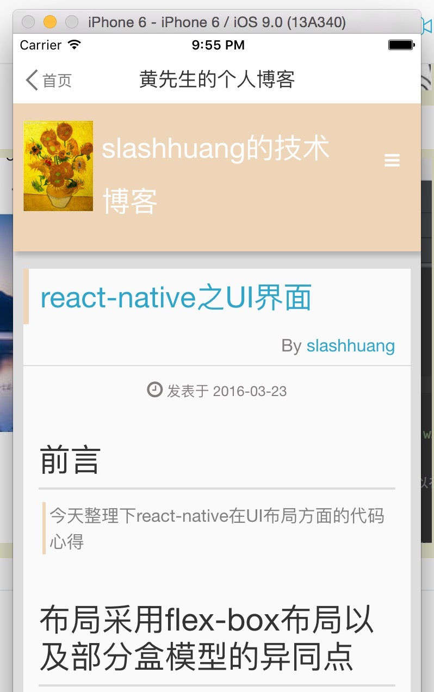
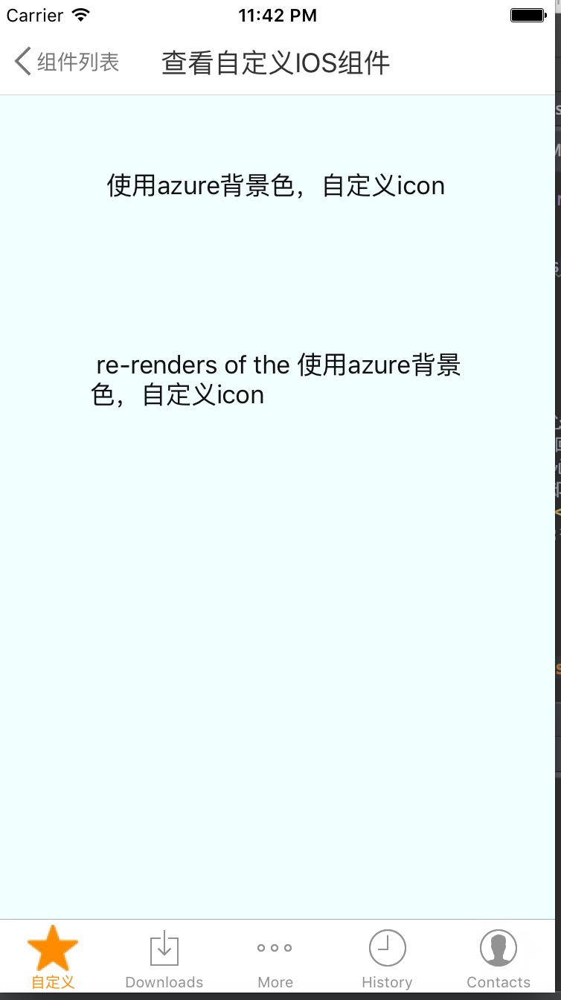

## react-native-demo
> 本项目综合了如下react-native组件

- Navigator   路由
- WebView     网页  
- TouchableHighlight   点按动作
- View  布局
- Text 文本
- react-native-swiper 图片浏览
- 自定义组件 

### 首页展示了自定义的IOS组件和Webview入口

### 使用
```
  cd ios
  open mockTMall.xcodeproj
  
```
#### 效果图
<div style={width:100%;}}>




</div>


