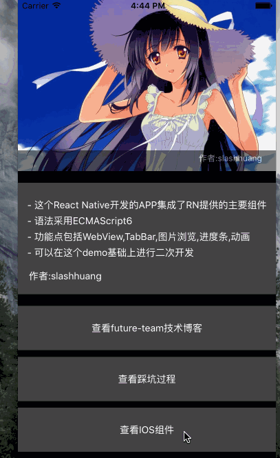
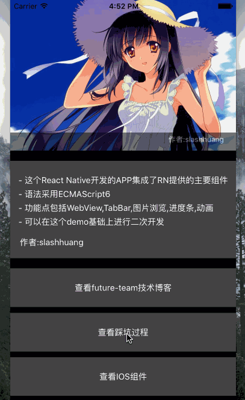
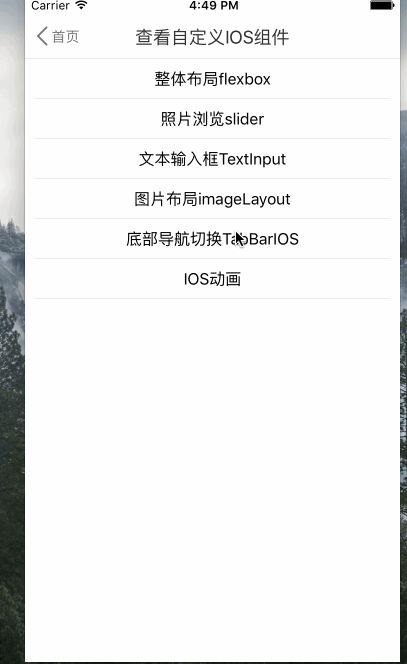
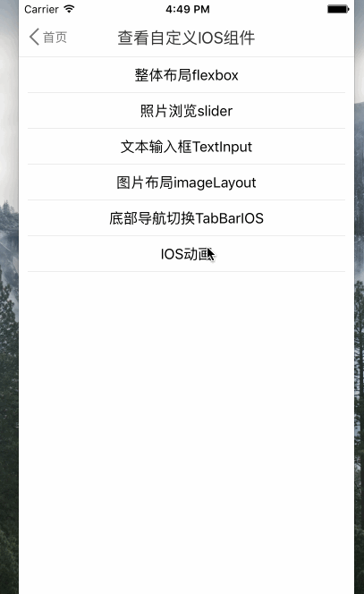
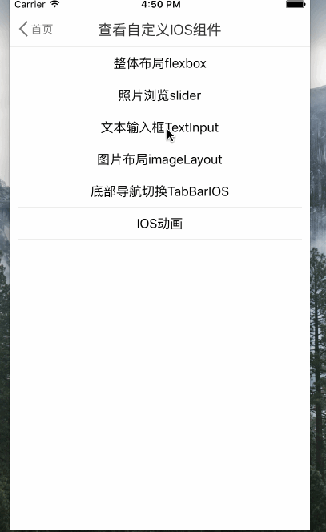
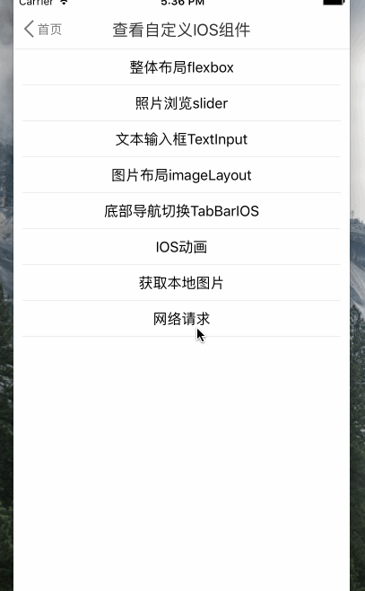
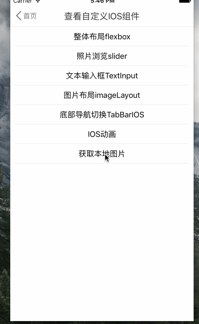

## react-native-demo
> 本项目综合了如下react-native组件

- Navigator   路由
- WebView     网页  
- TabBarIOS   导航切换栏
- TouchableHighlight   点按动作
- View  布局
- Text 文本
- react-native-swiper 图片浏览
- 自定义组件 

> 本项目综合了如下react-native的API

- Animated   动画
-  fetch     网络请求
- Alert     模拟html的alert
-  CameraRoll  调用本地照片

### 使用
```
  cd ios
  open mockTMall.xcodeproj
  
```
#### 效果图

>主页入口－flex布局   



>WebView页面



>TabBarIOS 



>  Animated动画



>TextInput



>调用fetch网络请求



>调用本地API




